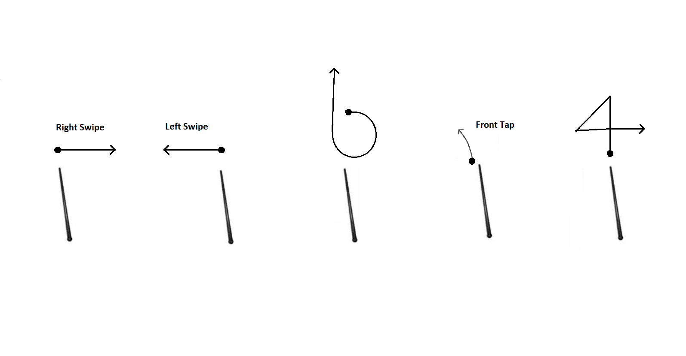
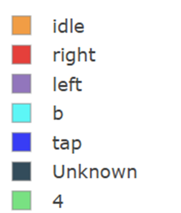
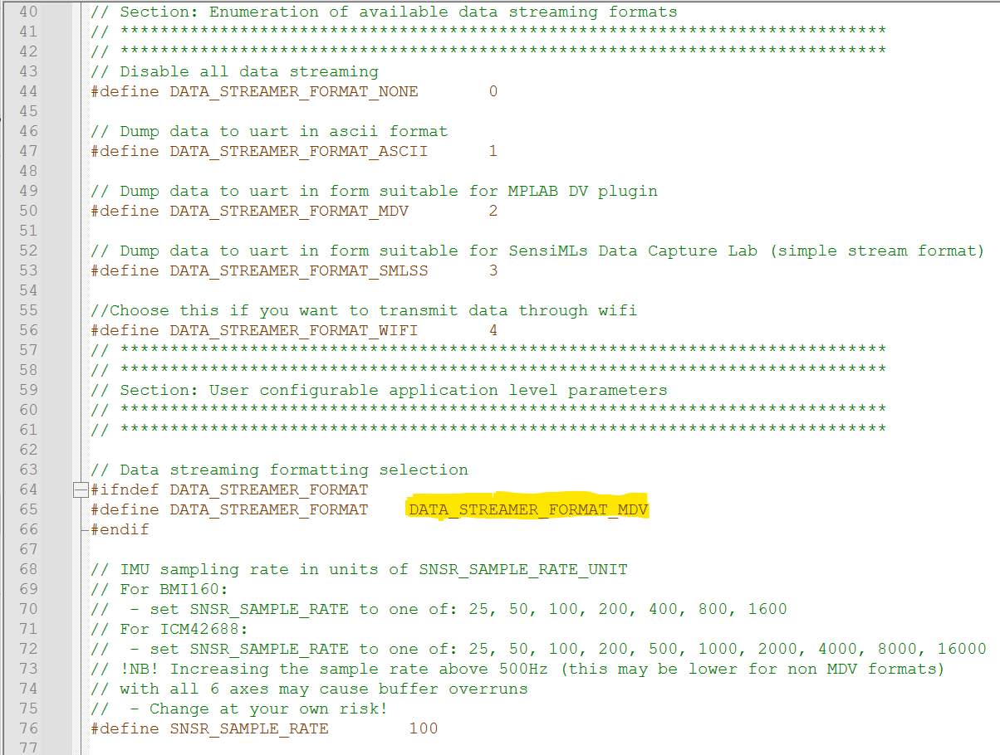
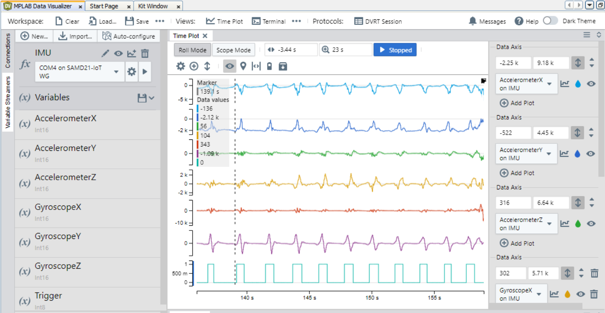
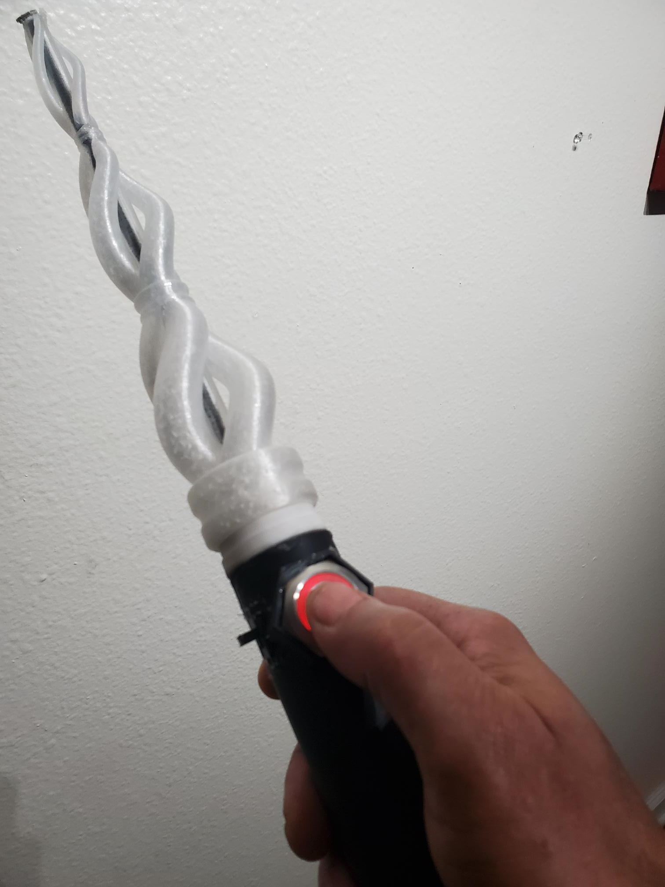
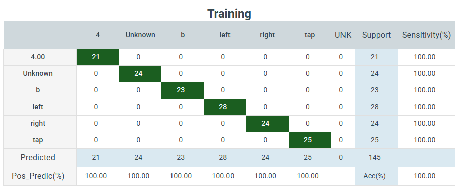

# Wand Gestures with MPLAB® Machine Learning Development Suite
|  |
| :--: |
| Wand Gesture Recognizer |

## Repository Overview
This repository contains the firmware to classify a Wand Gesture detection on a SAMD21 Machine Learning Kit with the [TDK ICM42688 IMU](https://www.microchip.com/DevelopmentTools/ProductDetails/PartNO/EV18H79A) ([Mikroe IMU14 click board](https://www.mikroe.com/6dof-imu-14-click)).

The supported activities are:

- *Idle*
- *Right Swipe*
- *Left Swipe*
- *b*
- *Front Tap*
- *4*

In addition there is also an 'unknown' class for gesture-like movement and an 'idle' class for low motion activity.

| 

## Triggered Gestures Dataset

The [Activity dataset](https://github.com/k-mchp/d21-wand/tree/main/wand_training_data/w5) was collected by Microchip employees along with other individuals and consists of subjects performing the wand gestures as described in the section above with a [SAMD21 TDK ICM42688 evaluation board](https://www.microchip.com/DevelopmentTools/ProductDetails/PartNO/EV18H79A). The dataset includes a collection of samples in CSV format (Ax, Ay, Az, Gx, Gy, Gz, TR format) split into training and test folds. 

## Continuous Gestures Dataset

The [Activity dataset](https://github.com/k-mchp/d21-wand/tree/main/wand_training_data/w4) includes a collection of samples in CSV format (Ax, Ay, Az, Gx, Gy, Gz format) split into training and test folds. 

In addition to the target activities, some additional gestures random activity signals  were collected to make up the *unknown* gestures class, which is used to help improve and validate the model's discriminatory ability.

Furthermore, the *idle* class data consists of scenarios where the device is fully at rest in different orientations and other scenarios with small motion activities that includes fidgeting with the board (manipulating the board randomly with the fingers) and pacing around the room while holding the board.

## Wand Setup

Below is the app_config.h file in the wand_firmware project. Default format is NONE, which will put the wand ininference mode.  Just do gestures and watch the LED change color based on gestures.  MDV format will setup the wand to collect data via the Data Visualizer in MPLAB.

## Wand Data collector usage

Below is a screenshot of the Data Visualizer logging triggered data from the Wand.  For triggered wand data you must press the button as you carry out gestures.  You must also use the triggered DV workspace [here](https://github.com/k-mchp/d21-wand/blob/main/mplab_dv_workspaces/6dof-imu-acc-gyr-trigger.dvws)

For continuous wand data use the continuous DV workspace [here](https://github.com/k-mchp/d21-wand/blob/main/mplab_dv_workspaces/6dof-imu-acc-gyr.dvws)

## Hardware Used
* SAMD21 Machine Learning Evaluation Kit with TDK ICM42688 IMU [(EV18H79A)](https://www.microchip.com/developmenttools/ProductDetails/EV18H79A)

## Software Used
* [MPLAB® X IDE](https://microchip.com/mplab/mplab-x-ide)
* [MPLAB® XC32 Compiler](https://microchip.com/mplab/compilers)
* [MPLAB® Harmony 3](https://www.microchip.com/harmony)
* [MPLAB® ML Model Builder](https://onlinedocs.microchip.com/v2/keyword-lookup?keyword=MPLAB-ML-Documentation&redirect=true)

## Related Documentation
* ATSAMD21G18 [Product Family Page](https://www.microchip.com/wwwproducts/en/ATSAMD21G18)
* SAM-IoT WG Development Board [Product Details](https://www.microchip.com/developmenttools/ProductDetails/EV75S95A)
* MikroElektronika IMU Click Boards
   * [6DOF IMU 14 Click](https://www.mikroe.com/6dof-imu-14-click)

# Firmware Operation
The firmware behavior can be summarized as operating in one of three distinct states as reflected by the onboard LEDs and described in the table below:

| State |	LED Behavior |	Description |
| --- | --- | --- |
| Error |	Red (ERROR) LED lit |	Fatal error. (Do you have the correct sensor plugged in?). |
| Buffer Overflow |	Yellow (DATA) and Red (ERROR) LED lit for 5 seconds	| Processing is not able to keep up with real-time; data buffer has been reset. |
| Running | Yellow (DATA) LED flashing slowly |	Firmware is running normally. |

In addition, the firmware also prints the classification output for each inference over the UART port. Connect to the COM port of the SAMD21 kit with the following settings:

- Baudrate 115200
- Data bits 8
- Stop bits 1
- Parity None

## Performing Gestures
Gestures should be performed in a way that feels natural, using a thumb and index finger grip around the SAMD21 board as shown in the image below. The top of the board should be facing away from the user, with the USB connector oriented towards the ground.

|  |
| :--: |
| Thumb and index finger grip |

## Training Confusion Matrix
Below is the confusion matrix for the test dataset. This depicts the number of times the model correctly choose the classifiaction ID.

# Sensor Configuration

Sensor configuration values used in the data collection are summarized in the table below.

| IMU Sensor | Axes | Sampling Rate | Accelerometer Range | Gyrometer Range |
| --- | --- | --- | --- | --- |
| TDK ICM42688 | Ax, Ay, Az, Gx, Gy, Gz, Tr | 100Hz | 16G | 2000DPS |
